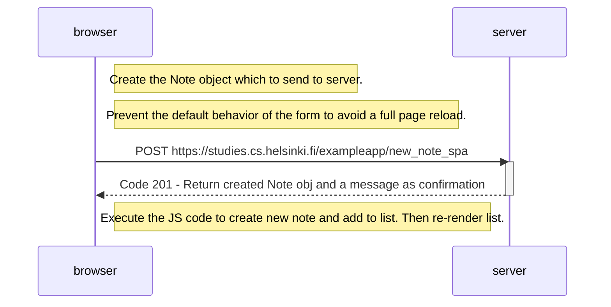

```mermaid
sequenceDiagram
participant browser
participant server

    Note right of browser: Create the Note object which to send to server.
    Note right of browser: Prevent the default behavior of the form to avoid a full page reload.

    browser->>server: POST https://studies.cs.helsinki.fi/exampleapp/new_note_spa
    activate server

    server-->>browser: Code 201 - Return created Note obj and a message as confirmation
    deactivate server

    Note right of browser: Execute the JS code to create new note and add to list. Then re-render list.
```
